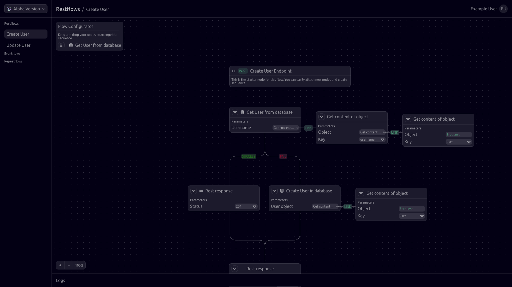

# Revolutionizing Development with No-Code Solutions: Meet code0

Since the dawn of programming, making an application has become a lot more straightforward. You don't have to start from
scratch building payment systems or a whole framework for your website anymore.

Over time, there's been an explosion of tools to help developers, but with so many choices, a new problem arises:
picking the right tech stack. Let's say you're diving into backend development. Your first hurdle? Choosing a
programming language. You've got two main options: go with what you know best or pick the language best suited for your
app. If your app needs to be fast, reliable, and efficient with memory, low-level languages like Rust or Go are solid
choices. But if you're comfortable with C# or Java, the decision gets tougher. Do you learn something new or stick to
what you already know? Generally, it's wise to stick with what you're good at for serious projects (though learning new
skills is crucial too, especially if your application demands it).

But even after settling on a programming language, the challenges persist. Which framework and database do you go
for? These decisions are even trickier on the frontend with all the frameworks out there. It's a maze of choices, isn't
it?

## Navigating through the Tech Stack Maze

For many, this is why embarking on a development journey feels daunting. Without a specific project in mind, just
picking a tech stack and learning it seems like an impossible task. Setting up a backend
alone can eat up a massive amount of time. Once you've settled on libraries and frameworks, mapping out the software
architecture becomes a complex puzzle. You outline every feature, only to realize later that a mistake made early on is
now blocking progress. Next comes the database scheme, an optional but beneficial step for building applications. Then
it's time to fire up your IDE and start coding, followed by testing, debugging and a dozen of bug fixes. After hours of
troubleshooting, you finally get your application running smoothly. But there's still one more hurdle: deployment. Even
the seemingly simple task of setting up a server can be time-consuming.

**Keep in mind, this is just a simplification of the process of backend-development.**

Programming is essentially about problem-solving, and that's where code0 comes into play. Building a backend requires a
significant investment of time and experience. You need years of experience in your chosen programming language, a solid
grasp of your chosen database, and much more. Unfortunately, with the vast array of development options available, not
everyone can solve their own problems or contribute to society through programming. That's where our no-code
backend-building software comes in. No-code means exactly that: you can build an application without writing a single
line of code. It's like a box of Lego pieces—versatile and adaptable. You can construct anything from a house to a
spaceship to a tree. Let's start with this analogy.

## Exploring the Web Editor: A Sneak Peek into the Future of Backend-Development

Here's a snapshot of the web editor, captured on the day of this blog's release. In the image, you can observe a basic
RESTful API setup, designed for creating users with specific properties. For those unfamiliar with RESTful APIs, here's
a brief overview: it's a widely used API pattern that facilitates data exchange via HTTP, the standard protocol for web
communication.

When data is sent to this API, it undergoes validation. Certain properties, such as passwords and email addresses,
require specific validation criteria. If the submitted properties pass validation, the system proceeds to execute
certain actions. For instance, in the case of a successful request, the user will receive an email prompting further
registration steps. Additionally, a notification will be dispatched to a designated user
via [Microsoft Teams](https://www.microsoft.com/en-gb/microsoft-teams/group-chat-software/)
, informing them that a new account has been created.

This example illustrates the fundamental functionality of the web editor. While RESTful APIs are a core feature, the
editor will support various other functionalities including cron jobs, event-based flows or other protocols like MQTT
outside the common backend/frontend development. Stay tuned for more insights in upcoming blogs.

**The Inner Workings of the Web Editor**

At first glance, the image may seem like a simple interface, but beneath the surface, numerous processes are taking place.
Let's delve into what's happening behind the scenes:

1. **Route Creation and Data Reception**:
    - A route is established to receive data sent to a specific URL.
    - Upon reception, the data undergoes validation.

2. **Response Handling**:
    - The sender receives a response indicating the success or failure of the request to create a new user entry.
    - If successful, the created entry is returned with a status code of 200. Otherwise, a 4xx/5xx error is issued,
      detailing the mistakes made during user creation.

3. **Error Handling**:
    - For example, if the email address lacks the "@" symbol, the request is denied, accompanied by an error message
      such as: "Error while creating a user, email property doesn't contain an @".

4. **Post-Request Actions**:
    - Upon success, additional actions occur, such as database entry creation and potential triggering of other
      services.
    - Email and Microsoft Teams integration are just two examples of the multitude of software and APIs that can be
      utilized.

5. **Playback and Configuration**:
    - All defined flows can be executed by pressing the play button.
    - Changes require a restart to take effect, but modifications are fully customizable.
    - Automatic database migrations and path adjustments are seamlessly handled.

6. **Component Functionality**:
    - The components provided serve specific functions, eliminating the need for manual coding.
    - Each component is equipped with configurable settings, allowing for flexibility and customization.

This is just a preview what's to come! So join Us in Shaping the Future with code0.

Creating an application like this could just take minutes, a stark contrast to the time-consuming deployment processes
and troubleshooting common with traditional tools and software. Our vision is to revolutionize backend development, making it
accessible to all, regardless of programming experience. Whether you're a seasoned developer or a newcomer to
programming, code0 is here to empower you.

If you're interested in the continued evolution of code0, follow us on our [social media]((https://linktr.ee/code0tech))
channels. If you're eager to contribute to the future of backend development, check out
our [GitHub](https://github.com/code0-tech).

Your code0 team ❤️