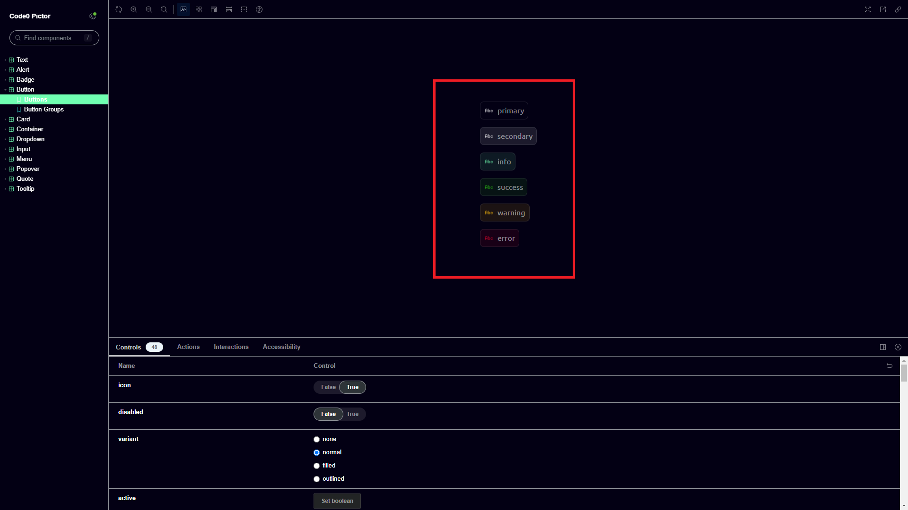

A well-designed and well-thought website has many benefits. Its catchy, leaves a lasting good impressions on the viewer
and potential customers. It reflects the professionalism and attention to detail of the creator/company. Having an
in-house component library can streamline the design and development process, ensuring consistency
across different parts of the website or even across multiple projects. It also allows for easier
maintenance and updates, as well as fostering collaboration among design and development teams. Overall, investing in a
well-designed website and maintaining an in-house component library can yield numerous benefits for modern software
companies, from enhancing brand image to improving user satisfaction.

## But what's a component library

If you have worked with Apple's applications before, you might notice that there is consistency throughout their design.
That's thanks to their component library. Once programmed and styled it can be used throughout their
software.

1. **Consistency and Professionalism:** A centralized library ensures consistent design across products, fostering brand
   recognition and a professional look.
2. **Time and Cost Savings:** Reusing components saves time and money by streamlining development and reducing the need
   for repetitive redesign work.
3. **Scalability and Efficiency:** The library facilitates faster development, better collaboration, and easier
   maintenance
   as companies scale and introduce new products.
4. **Improved User Experience:** By adhering to established design principles and accessibility standards, the library
   helps create more cohesive, accessible, and user-friendly products.

Just to name some benefits!

## When to create a component library?

While the cost and need for skilled workers can be barriers for small businesses, developer-friendly component libraries
like trendy `shadcn` offer ready-made solutions. These libraries accelerate development and enhance productivity.

Regardless of the organization's size, creating a component library becomes essential for scalability and streamlined
development across multiple projects. Additionally, it's an artistic choice as design impacts user experience and brand
identity. If existing libraries don't align with the desired design, creating a custom solution ensures control over
aesthetics and functionality.

## Why we build pictor.

Our primary goal was to deliver an exceptional user experience. Existing component libraries didn't meet our design
standards. Many were too strict and didn't align with our vision. Additionally, our complex component architecture
made adopting an existing library risky, as it could compromise simplicity and result in a cluttered main application.
To ensure a seamless user experience and facilitate future product expansion, we
created [pictor](https://github.com/code0-tech/pictor).

## But how to start on creating a library.

1. **Breaking a whole website into components**

Avoid the mistake of thinking too big. Break down your website into reusable
components. Components like a navbar or footer can be decomposed further into smaller elements like logos or actions,
enabling reusability and configurability across your site.

2. **Start Small, Scale Up**:

Plan the order in which you'll create components. Even seemingly simple elements like buttons
can be broken down into multiple components. Visualize your components before diving in to ensure a clear development
path.

## Meet storybook

3. **Start Developing**:

Utilize [Storybook](https://storybook.js.org/docs/get-started) for easier component library development. Storybook
allows you to create, style,
and configure components in isolation, mimicking real-life development scenarios without interference from other
components.

A little example:

We programmed and designed our buttons. The nice thing about storybook is, you can build one component at a time.
Now we can preview or design and make live changes. The buttons got properties like active/inactive, with or without an
icon, changed background-color and so on.

4. **Release**:

Once development is complete, publish your library. Consider automating the release process using Gitlab pipelines
or GitHub actions for seamless distribution. Whether for public use or internal purposes, make your library easily
accessible to others.

Feel free to use it or contribute. It's not just for us; it's for the community. Check it out!

Your code0 team ❤️